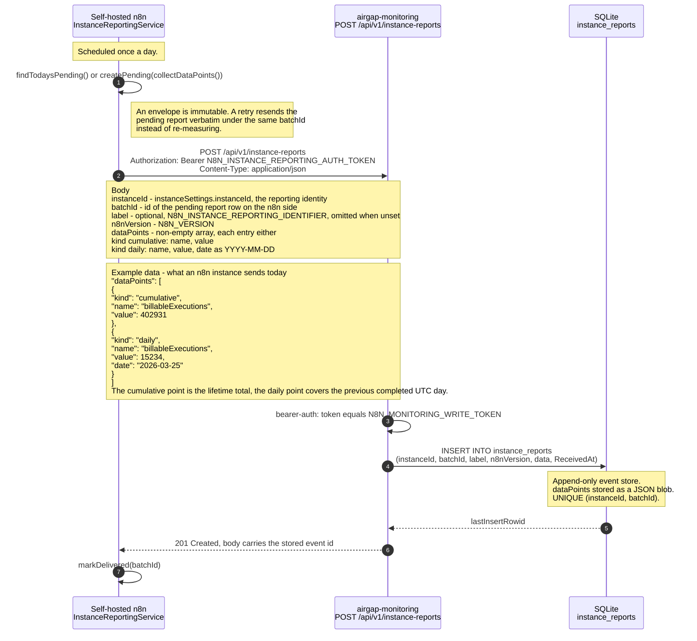

# Diagrams

## n8n instance reports data to airgap-monitoring service

The service exposes a single write endpoint, `POST /api/v1/instance-reports`.
A self-hosted n8n instance posts one report per day to it; the operator sets the
same secret on both sides (`N8N_INSTANCE_REPORTING_AUTH_TOKEN` on n8n,
`N8N_MONITORING_WRITE_TOKEN` here).

The diagram shows the happy path only. The endpoint also answers `401` for a
missing or wrong token, `400` for a body the schema rejects, and `409` when an
already-accepted `batchId` is repeated for the same `instanceId`.



### Example payload

The two data points every n8n report carries today, for the last completed UTC day:

```http
POST /api/v1/instance-reports HTTP/1.1
Authorization: Bearer <shared token>
Content-Type: application/json
```

```json
{
  "instanceId": "450b5c8502c2a390dba93257bde5fe7eb39397d43d8b307e8626f9d84b19e4d2",
  "batchId": "a1b2c3d4",
  "label": "prod",
  "n8nVersion": "1.99.0",
  "dataPoints": [
    { "kind": "cumulative", "name": "billableExecutions", "value": 402931 },
    {
      "kind": "daily",
      "name": "billableExecutions",
      "value": 15234,
      "date": "2026-03-25"
    }
  ]
}
```

`dataPoints` is open: metric names are chosen by the reporting instance, so only
the envelope (`cumulative` vs `daily`) is pinned down by the schema. The n8n
implementation is in
[`instance-reporting.service.ts`](https://github.com/n8n-io/n8n/blob/3c1f4a6a08d419bfb78a158fbcab68f158bde1c2/packages/cli/src/modules/instance-reporting/instance-reporting.service.ts#L52-L93).

## Download collected data via http endpoint

To be added as part of https://linear.app/n8n/issue/API-203/add-endpoint-to-download-instance-report