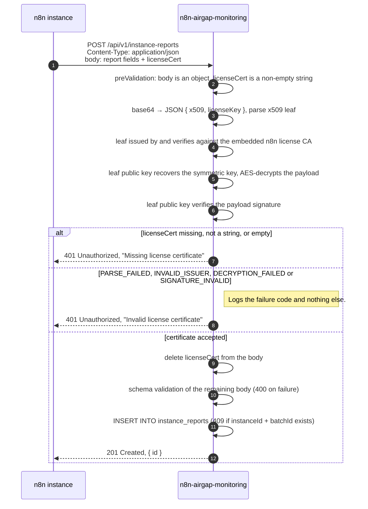

# Authorization

How n8n-airgap-monitoring decides whether to act on an incoming request.

## Simple string token auth for GET /api/v1/report

The report download is guarded by one shared secret, the read token. The
operator generates it and sets it on the service as `N8N_MONITORING_READ_TOKEN`;
the service refuses to start without it. The token is read once at start-up,
so a rotation needs a restart.

A request must carry the token verbatim as a bearer token:

```http
GET /api/v1/report HTTP/1.1
Authorization: Bearer <N8N_MONITORING_READ_TOKEN>
```

The check is `@fastify/bearer-auth` with the read token as its only key. A
request without an `Authorization` header, or with a bearer token that does
not equal the configured value, is answered with `401 Unauthorized`. There is
nothing else to it: no users, no scopes, no expiry.

Reporting n8n instances never hold this token, so an instance that can write
reports cannot read the fleet's data. How to download the report and share it
is covered in the
[user guide](USER_GUIDE.md#3-download-usage-reports-from-n8n-airgap-monitoring).

## Create instance report route

`POST /api/v1/instance-reports` runs in one of two modes. The operator picks
the mode by whether `N8N_MONITORING_WRITE_TOKEN` is set on the service; the
choice is read once at start-up, and there is no mode that accepts both
credentials.

| `N8N_MONITORING_WRITE_TOKEN` | Mode | Accepted credential | What keeps outsiders out |
| --- | --- | --- | --- |
| unset | certificate mode | the instance's n8n license certificate, in the request body | the network: only your own instances may reach the endpoint |
| set | token mode | that token, as an `Authorization: Bearer` header | the token itself, over TLS |

In either mode the check runs as a Fastify `preValidation` hook on the route.
The body has been parsed as JSON at that point, but the route schema has not
seen it yet, so a bad credential is answered with `401` before a malformed
report would be answered with `400`, and an unauthenticated caller learns
nothing about the schema. In either mode `licenseCert` is deleted from the
body before the route schema and the service that persists the report see it,
so a certificate sent to a token-mode service is neither verified nor stored.

### License certificate in request body

This is certificate mode, active when no write token is set. A reporting n8n
instance proves that it is a licensed instance by sending its
n8n license certificate with every report. Possession of a certificate that the
n8n license CA issued is the whole check: the service reads no identity from
it, stores nothing from it, and contacts no external system to verify it. The
rationale is in
[ADR 10](adr/2026-09-21-authenticate-with-license-certificate.md); the
request flow and the full body layout are in
[DIAGRAMS.md](DIAGRAMS.md#n8n-instance-reports-data-to-airgap-monitoring-service).

#### What the n8n instance sends

The certificate travels in the JSON request body as the top-level field
`licenseCert`, not in a header. A real certificate is about 7 KB and grows
with every feature flag, which sits too close to the 8 KB per-header default
of common reverse proxies.

`licenseCert` is a string: the base64 encoding of a JSON object with two
string fields.

| Field | Content |
| --- | --- |
| `x509` | A PEM-encoded X.509 leaf certificate, issued and signed by the n8n license CA. |
| `licenseKey` | The license payload, framed as `-----BEGIN LICENSE KEY-----` … `-----END LICENSE KEY-----`. Between the markers are three `\|\|`-separated parts: the encrypted symmetric key, the AES-encrypted payload, and the payload signature. Line breaks inside the string are ignored. |

The rest of the body is the report itself: `instanceId`, `batchId`,
`n8nVersion`, `dataPoints` and the optional `label`. Their meaning and an
example payload are documented in
[DIAGRAMS.md](DIAGRAMS.md#example-payload). On the n8n side the value sent as
`licenseCert` is the instance's `N8N_LICENSE_CERT`, see the
[user guide](USER_GUIDE.md#2-configure-your-self-hosted-n8n-instances-to-report-to-n8n-airgap-monitoring).

#### What the service checks

The steps run in this order. The first failing step ends the request.

1. **Presence.** The body must be a JSON object (not an array or a scalar)
   and `licenseCert` must be a non-empty string. Otherwise the request is
   rejected with `401` and the message `Missing license certificate`.
2. **Container parsing.** The string must be at least 50 characters, decode
   from base64 to JSON, and that JSON must carry string fields `licenseKey`
   and `x509`. Failure code: `PARSE_FAILED`.
3. **Leaf parsing.** `x509` must parse as an X.509 certificate. Failure code:
   `PARSE_FAILED`.
4. **Issuer.** The leaf must have been issued by the embedded n8n license CA
   (`checkIssued`) and its signature must verify against that CA's public key
   (`verify`). Failure code: `INVALID_ISSUER`.
5. **License key format.** After removing line breaks, `licenseKey` must match
   the `BEGIN LICENSE KEY` / `END LICENSE KEY` framing with exactly three
   `||`-separated parts. Failure code: `PARSE_FAILED`.
6. **Symmetric key recovery.** The first part is decrypted with the leaf's RSA
   public key. Failure code: `DECRYPTION_FAILED`.
7. **Payload decryption.** The second part is AES-decrypted with the recovered
   symmetric key. An error or an empty result fails with `DECRYPTION_FAILED`.
8. **Payload signature.** The third part must be a valid PKCS#1 v1.5 signature
   of the decrypted payload under the leaf's public key. Failure code:
   `SIGNATURE_INVALID`.
9. **Strip.** `licenseCert` is deleted from the request body. The route schema
   and the service that persists the report never see it.

Any failure in steps 2 to 8 is answered with `401` and the message
`Invalid license certificate`. The service logs a warning that carries the
failure code and nothing else: the certificate is the customer's license, so
neither it nor anything decoded from it reaches a log line or a response body.
The decrypted payload is used only to verify the signature and is then
discarded.

Nothing about the leaf's or the CA's validity period is inspected. Steps 4 to
8 use only the public keys; an expired leaf passes.

A body that is not valid JSON never reaches the hook because Fastify's
content-type parser rejects it first. That path is not part of this check and
its status code is not documented here.

#### What "authorized" means

Authorization here means only that the caller holds a license certificate n8n
issued. It binds the request to no identity and no tenant:

- No field is extracted from the certificate for the handler. The verifier
  returns nothing, and the certificate is removed from the body before the
  handler runs.
- `instanceId`, `label` and every other report field are self-declared by the
  caller. They are not compared with anything in the certificate.
- Any n8n licensee's certificate is accepted, not only certificates of the
  customer operating this service. This is why certificate mode requires the
  endpoint to be reachable only from the customer's own instances. An
  operator who cannot or does not want to guarantee that runs the service in
  token mode instead, where the certificate is not a credential.

The handler may therefore trust exactly one thing: that whoever sent the body
possessed a genuine n8n license certificate. It trusts nothing else from it.

#### What is not verified

The following are deliberately not checked, as stated in the verifier's source
and in ADR 10:

- **Expiry, termination and clock skew** of the license. An expired instance is
  still a licensed instance and its reports are still wanted; a test pins that
  an expired certificate is accepted.
- **Entitlements, features, tenant and device fingerprint** carried in the
  license payload. The payload is decrypted only to verify its signature.
- **Binding to the reporting instance.** `instanceId` is not tied to anything
  in the certificate, and one certificate may be used by any number of
  instances.
- **Which customer the certificate belongs to.** Any n8n-issued certificate
  unlocks any customer's receiver.

Reuse of a certificate across requests is not restricted. The only replay
guard on the endpoint is the `409` for a repeated `instanceId` and `batchId`
pair, which is a property of the report envelope, not of the certificate.

#### Configuration

The only setting that affects this check is the mode switch: an unset
`N8N_MONITORING_WRITE_TOKEN` is what puts the service in certificate mode. No
variable changes what the check itself accepts.

The trusted issuer is a single X.509 CA certificate compiled into the service
image: the constant `N8N_LICENSE_ISSUER_CERT_PEM` in
`apps/api/src/license/issuer-cert.ts`. Its subject is `license.n8n.io` and it
is valid until 2049. It is the same CA certificate that the public
`@n8n_io/license-sdk` embeds. No operator setting adds to or replaces it; a CA
rotation ships as a new image.

The verifier is a local port of the check `ai-assistant-service` performs.
Verification is fully offline: the service makes no network call to n8n's
license server or anywhere else while checking a certificate.

#### Sequence



### Secret string as bearer auth header

This is token mode, active when the operator sets a write token on the service
as `N8N_MONITORING_WRITE_TOKEN`. It is a plain string of the operator's
making, read once at start-up, so a rotation needs a restart. Every report
must then carry it:

```http
POST /api/v1/instance-reports HTTP/1.1
Authorization: Bearer <N8N_MONITORING_WRITE_TOKEN>
Content-Type: application/json
```

The check is a constant-time comparison of the presented value with the
configured one. A request without a bearer header is answered with
`401 Unauthorized` and the message `Missing write token`, whatever its body
carries; a value that does not match is answered with `401 Unauthorized` and
the message `Invalid write token`, and the service logs the code `BAD_TOKEN`
and nothing about the presented value. There are no users, scopes or expiry.
License certificates are not a credential in this mode.

An n8n instance sends the token when `N8N_INSTANCE_REPORTING_AUTH_TOKEN` is set
on it, and then leaves `licenseCert` out of the body. This is the way to report
from an instance that has no license certificate, and the credential the local
tooling in this repository uses.

Unlike the certificate, the token is a secret shared between the operator and
their own instances, so it proves "belongs to this operator" rather than
"licensed by n8n". That is what makes token mode safe without network rules
that restrict the endpoint to the operator's instances; TLS and ordinary
secret handling are enough. The trade is that every instance must be given
the token.

### Rejection paths

| Status | Message | Condition |
| --- | --- | --- |
| `401 Unauthorized` | `Missing write token` | Token mode, and the request has no `Authorization: Bearer` header. A certificate in the body does not help. |
| `401 Unauthorized` | `Invalid write token` | Token mode, and the bearer value differs from the configured token. Logged as `BAD_TOKEN`. |
| `401 Unauthorized` | `Missing license certificate` | Certificate mode, and the body is not a JSON object, or `licenseCert` is absent, not a string, or an empty string. A bearer header does not help. |
| `401 Unauthorized` | `Invalid license certificate` | `PARSE_FAILED`: string shorter than 50 characters, not base64 JSON, JSON without string `licenseKey` and `x509`, `x509` not a parseable certificate, or `licenseKey` not in the `BEGIN LICENSE KEY` framing with three parts. |
| `401 Unauthorized` | `Invalid license certificate` | `INVALID_ISSUER`: the leaf was not issued by, or does not verify against, the embedded n8n license CA. |
| `401 Unauthorized` | `Invalid license certificate` | `DECRYPTION_FAILED`: the symmetric key does not recover with the leaf's public key, or the payload does not decrypt to a non-empty string. |
| `401 Unauthorized` | `Invalid license certificate` | `SIGNATURE_INVALID`: the payload signature does not verify against the leaf's public key. |
| `400 Bad Request` | schema error | Certificate accepted, but the remaining body fails the route schema. Runs only after the certificate check. |
| `409 Conflict` | names the repeated `batchId` | Certificate accepted and body valid, but a report with the same `instanceId` and `batchId` is already stored. |

All error responses share the envelope `{ "statusCode", "error", "message" }`.
The failure code appears in the service log only, never in the response; the
[user guide](USER_GUIDE.md#monitoring-the-health-of-n8n-airgap-monitoring)
explains how to act on it.
