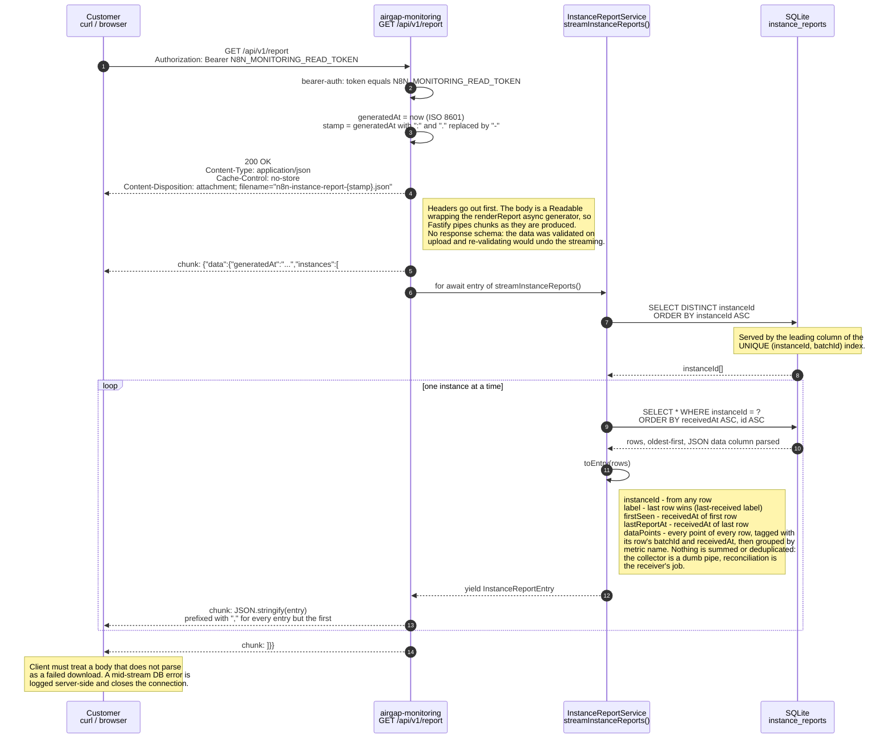

# Diagrams

## n8n instance reports data to airgap-monitoring service

The service exposes a single write endpoint, `POST /api/v1/instance-reports`.
A self-hosted n8n instance posts one report per day to it, carrying its n8n
license certificate (`N8N_LICENSE_CERT`) in the body as the credential. The
service verifies that the certificate was issued by the n8n license CA and
strips it from the body; nothing from it is stored. Alternatively, when the
operator has set `N8N_MONITORING_WRITE_TOKEN` on the service, the instance may
send that token as `Authorization: Bearer` instead
(`N8N_INSTANCE_REPORTING_AUTH_TOKEN` on n8n); see
[AUTHORIZATION.md](AUTHORIZATION.md#create-instance-report-route).

The diagram shows the certificate path and the happy path only. The endpoint
also answers `401` for a missing or invalid credential (checked before the
schema, so an unauthenticated caller learns nothing about it), `400` for a body
the schema rejects, and `409` when an already-accepted `batchId` is repeated
for the same `instanceId`.

```mermaid
---
config:
  sequence:
    noteAlign: left
---
sequenceDiagram
    autonumber
    participant N8N as Self-hosted n8n<br/>InstanceReportingService
    participant API as airgap-monitoring<br/>POST /api/v1/instance-reports
    participant DB as SQLite<br/>instance_reports

    Note over N8N: Scheduled once a day.
    N8N->>N8N: findTodaysPending() or createPending(collectDataPoints())
    Note right of N8N: An envelope is immutable. A retry resends the<br/>pending report verbatim under the same batchId<br/>instead of re-measuring.

    N8N->>API: POST /api/v1/instance-reports<br/>Content-Type: application/json

    Note over N8N,API: Body<br/>instanceId - instanceSettings.instanceId, the reporting identity<br/>batchId - id of the pending report row on the n8n side<br/>label - optional, N8N_INSTANCE_REPORTING_LABEL, omitted when unset<br/>n8nVersion - N8N_VERSION<br/>dataPoints - non-empty array, each entry either<br/>kind cumulative: name, value<br/>kind daily: name, value, date as YYYY-MM-DD<br/>licenseCert - License.loadCertStr(), the credential; not part of the stored envelope

    Note over N8N,API: Example data - what an n8n instance sends today<br/>"dataPoints": [<br/>{<br/>"kind": "cumulative",<br/>"name": "billableExecutions",<br/>"value": 402931<br/>},<br/>{<br/>"kind": "daily",<br/>"name": "billableExecutions",<br/>"value": 15234,<br/>"date": "2026-03-25"<br/>}<br/>]<br/>The cumulative point is the lifetime total, the daily point covers the previous completed UTC day.

    API->>API: preValidation: no bearer header, so licenseCert is checked:<br/>it chains to the n8n license CA and its payload signature verifies;<br/>then licenseCert is deleted from the body
    API->>API: schema validation of the remaining body
    API->>DB: INSERT INTO instance_reports<br/>(instanceId, batchId, label, n8nVersion, data, receivedAt)
    Note over DB: Append-only event store.<br/>dataPoints stored as a JSON blob.<br/>UNIQUE (instanceId, batchId).
    DB-->>API: lastInsertRowid
    API-->>N8N: 201 Created, body carries the stored event id

    N8N->>N8N: markDelivered(batchId)
```

### Example payload

The two data points every n8n report carries today, for the last completed UTC day:

```http
POST /api/v1/instance-reports HTTP/1.1
Content-Type: application/json
```

```json
{
  "instanceId": "450b5c8502c2a390dba93257bde5fe7eb39397d43d8b307e8626f9d84b19e4d2",
  "batchId": "a1b2c3d4",
  "label": "prod",
  "n8nVersion": "1.99.0",
  "dataPoints": [
    { "kind": "cumulative", "name": "billableExecutions", "value": 402931 },
    {
      "kind": "daily",
      "name": "billableExecutions",
      "value": 15234,
      "date": "2026-03-25"
    }
  ],
  "licenseCert": "<base64 n8n license certificate, about 7 KB>"
}
```

`dataPoints` is open: metric names are chosen by the reporting instance, so only
the envelope (`cumulative` vs `daily`) is pinned down by the schema. The n8n
implementation is in
[`instance-reporting.service.ts`](https://github.com/n8n-io/n8n/blob/3c1f4a6a08d419bfb78a158fbcab68f158bde1c2/packages/cli/src/modules/instance-reporting/instance-reporting.service.ts#L52-L93).

## Download collected data via http endpoint

The service exposes a single read endpoint, `GET /api/v1/report`. A customer
downloads the full usage report, every value every instance ever reported, as
one JSON file and shares it with n8n. The endpoint is guarded by a secret
(`N8N_MONITORING_READ_TOKEN`) that reporting n8n instances never hold, so an
instance that can write reports cannot read the fleet's data.

The report is streamed, one instance at a time, instead of being built in memory
(see [ADR 9](adr/2026-09-11-stream-instance-report.md)). Peak memory tracks
the largest single instance's history, not the number of instances. The price is
N+1 queries and that a DB failure after the first chunk yields a truncated file
rather than an error status, because the `200` is already on the wire.

The diagram shows the happy path only. The endpoint also answers `401` for a
missing or wrong token.



### Example response

One instance that reported twice and was relabelled in between:

```http
GET /api/v1/report HTTP/1.1
Authorization: Bearer <read token>
```

```http
HTTP/1.1 200 OK
Content-Type: application/json
Cache-Control: no-store
Content-Disposition: attachment; filename="n8n-instance-report-2026-03-28T08-00-00-000Z.json"
```

```json
{
  "data": {
    "generatedAt": "2026-03-28T08:00:00.000Z",
    "instances": [
      {
        "instanceId": "450b5c8502c2a390dba93257bde5fe7eb39397d43d8b307e8626f9d84b19e4d2",
        "label": "prod-renamed",
        "firstSeen": "2026-03-26T02:00:00.000Z",
        "lastReportAt": "2026-03-27T02:00:00.000Z",
        "dataPoints": {
          "billableExecutions": [
            { "kind": "cumulative", "value": 402931, "batchId": "a1b2c3d4", "receivedAt": "2026-03-26T02:00:00.000Z" },
            { "kind": "daily", "value": 15234, "date": "2026-03-25", "batchId": "a1b2c3d4", "receivedAt": "2026-03-26T02:00:00.000Z" },
            { "kind": "cumulative", "value": 418165, "batchId": "e5f6a7b8", "receivedAt": "2026-03-27T02:00:00.000Z" },
            { "kind": "daily", "value": 15234, "date": "2026-03-26", "batchId": "e5f6a7b8", "receivedAt": "2026-03-27T02:00:00.000Z" }
          ]
        }
      }
    ]
  }
}
```