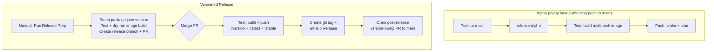

# Release Process

One image, `ghcr.io/n8n-io/n8n-airgap-monitoring`, published in two ways: an
alpha on every push to `main`, and a versioned release through a release PR. The
version lives in the root `package.json` and is the only version that matters;
`apps/api/package.json` is not published anywhere.

The process mirrors [n8n-sandbox-service](https://github.com/n8n-io/n8n-sandbox-service),
minus the parts that only make sense for cloud deployments (Docker Hub, private
registry mirror, staging candidates).

## Tags

| Tag         | Moves when                                       | Safe to reference in a deployment?                     |
| ----------- | ------------------------------------------------ | --------------------------- |
| `{sha}`     | never                                            | for reproducing a `main` build |
| `alpha`     | every push to `main` that touches the image      | no                          |
| `{version}` | never                                            | **yes, for airgapped deployments** |
| `latest`    | every versioned release                          | no                          |
| `stable`    | every versioned release, rolled back on a bad one | acceptable                  |

`latest` is the newest release. `stable` is the newest release we still
recommend: the two are pushed together and only diverge when a release turns out
broken and `stable` is moved back by hand (see "Recovering from a bad release").

Airgapped customers pull the image once and carry it across the air gap, so they
should always pin `{version}`: it names exactly what was tested and released, and
the `v{version}` git tag names the code it was built from.

## Alpha

`release-alpha` runs on every push to `main` that changes something in the image:
`apps/api/**`, the `Dockerfile`, the root `package.json`, the lockfile, the
workspace and turbo config, or the workflow itself. It runs the full test suite,
builds for `linux/amd64` and `linux/arm64`, and pushes `alpha` and the full commit
sha. A docs-only merge produces no image, so not every commit on `main` has a sha
tag. Run the workflow manually to build a commit the filter skipped, or with
"push" disabled for a dry run.

## Versioned release

### Steps

1. Go to Actions → Release Prep and run the workflow, choosing `patch`, `minor`,
   or `major`. Set the optional `version` input to release an exact `x.y.z`
   instead, which ignores `bump`. Use it to skip a version number that a past
   release burned: `bump` derives from `package.json`, so an abandoned version
   stays reachable by it.
2. The workflow bumps the version (via `scripts/set-release-version.sh`), then
   rejects it unless it is both unused (no `v{version}` tag and no
   `release/{version}` branch, so nothing is ever published twice) and strictly
   newer than every version already released or in flight. That floor is the
   highest of all `v*` tags and all `release/*` branches; branches count because a
   version is claimed at prep and only tagged at the end of publishing. Releases
   always build from the tip of `main`, so a lower number would ship newer code
   while moving `latest` and `stable` backwards.

   It then runs lint, typecheck, build, tests and a dry-run image build, creates
   the release branch `release/{version}`, and opens a PR into it from
   `release-pr/{version}` containing the one-line `package.json` bump.

   This orders the *starts* of releases, not their merges. Two releases can be in
   flight at once, and merging them out of order would move `latest` and `stable`
   backwards. Merge open release PRs in ascending version order.
3. Review the PR. **CI does not run on it automatically**: the PR is opened with
   the workflow's own `GITHUB_TOKEN`, and GitHub does not start workflows for
   events caused by that token. The prep run already validated the commit; close
   and reopen the PR if you want the CI check on the PR itself.
4. Merge the PR. This triggers `Release Publish`, whose `publish-image` job runs
   the tests and then builds and pushes the multi-arch image as `{version}`,
   `latest`, and `stable`.

   The job builds from the PR's merge commit rather than from the base branch by
   name, and takes the version from the base branch name (`release/{version}`)
   rather than from `package.json`. Merging the release PR is what puts the new
   version on that branch, so a job that resolves the branch name could still
   read the pre-merge tip. `package.json` is only cross-checked against the branch
   name, so a release PR that bumps to a different number fails before anything
   is pushed. As a second line of defence, publishing aborts if `v{version}`
   already exists, checked up front because the tag is otherwise only created at
   the very end, long after the image is public.

   `release-metadata` then creates the unforced git tag `v{version}`, a GitHub
   Release, and a post-release PR (`post-release/{version}`) that syncs the
   version back to `main`.
5. Merge the post-release PR. Like the release PR it needs a close and reopen to
   get CI to run.

The release branch stays around after the release. It is a convenient place to
browse the code of that version, and the place to land a hotfix for it should one
ever be needed.

### Recovering from a bad release

`Retag Image` (Actions → Retag Image) points existing tags at an image that is
already in GHCR. Its main use is rolling `stable` back to the previous version
while a broken release is fixed: run it with `source` set to the known-good
version, for example `1.0.0`, and `tags` set to `stable` (add `latest` to hide
the release entirely). The workflow resolves the source to its digest, refuses if
it does not exist or if a version tag is among the tags to move, and verifies
every tag after moving it. It cannot build or delete anything. The next release
moves both tags forward again.

## Git tag namespace

`v{version}`, e.g. `v1.0.0`. Release tags are immutable: publish creates them
unforced, so a tag always points at the commit its image was built from.

## Repository prerequisites

- **Allow GitHub Actions to create and approve pull requests** must be enabled
  under Settings → Actions → General. Both automated PRs are opened with
  `GITHUB_TOKEN`.
- A `release` label, applied to both automated PRs.
- The commits on the automated PRs are made through the GitHub API by
  `.github/scripts/create-signed-commit-pr.mjs`, so they are signed by GitHub and
  pass a signed-commit requirement on `main`.
